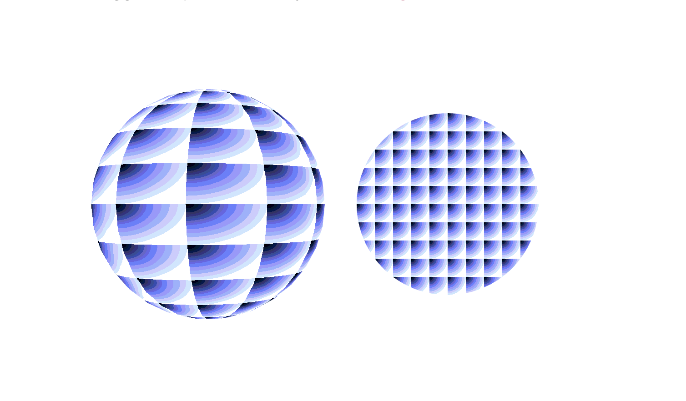
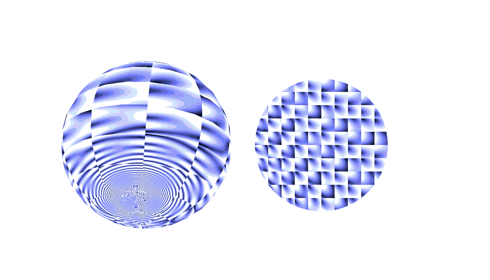
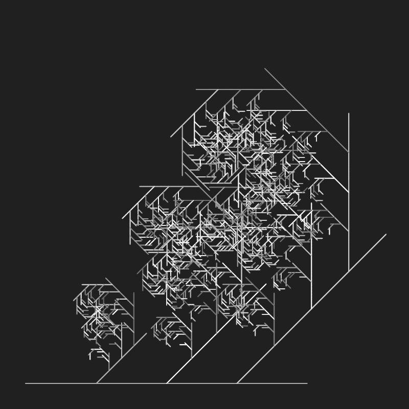
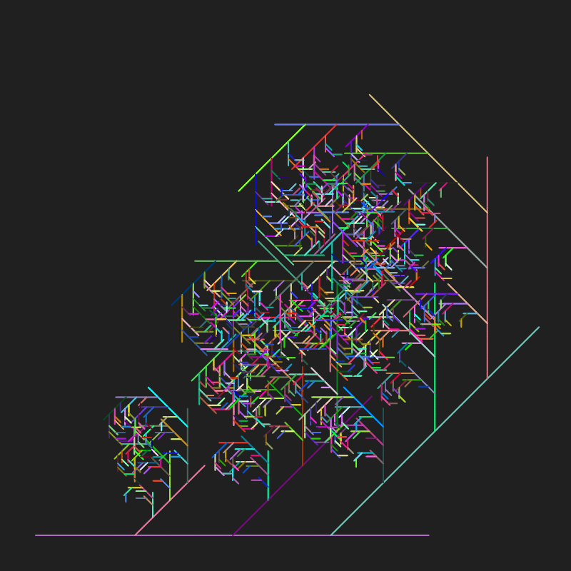

# xiyu0748_9103_tut7


# Quiz 8 – Imaging and Coding Technique

Since I am responsible for the **Time-based** mechanic in our group project, I focused on visual effects that change and evolve over time. I am interested in motion that can continue by itself, such as rotating textures, looping patterns, and lines that gradually grow or repeat.

---

# Part 1 – Imaging Technique Inspiration

## Case Study 1: Shader as a Texture





I am inspired by the **Shader as a Texture** example in p5.js. The example shows how shaders can be applied to 2D and 3D shapes as animated textures. I like how the surface does not stay still; it changes through time and mouse movement, making a simple sphere or ellipse feel more active. I would like to use a similar time-based texture effect in my project, because it can make the visual work feel alive even when the user is not constantly interacting with it.

### Reference

- [p5.js – Shader as a Texture](https://p5js.org/examples/advanced-canvas-rendering-shader-as-a-texture/)

---

## Case Study 2: Recursive Lines





I am also inspired by the **Recursive Lines** example from Happy Coding. In this sketch, each line draws itself and then creates more lines from its own length. I like the way a simple rule can gradually build a more complex visual structure. For my project, I want to explore this kind of growing or repeating motion over time. This is useful for the Time-based mechanic because the artwork can develop step by step, instead of appearing all at once.

### Reference

- [Happy Coding – Recursive Lines](https://happycoding.io/tutorials/p5js/creating-classes/recursive-lines)

---

# Part 2 – Coding Technique Exploration

## Coding Technique: Time-based Animation with Shaders and Recursive Drawing


The coding technique I want to explore is using time-based values to drive visual change. In the p5.js shader example, the `time` uniform can be used to animate textures on shapes. In the recursive lines example, repeated drawing rules can create a growing structure. These techniques could help my project by making shapes, textures, or lines change gradually over time. Instead of relying only on user input, the visual system can keep moving and developing by itself.

### Example Implementations

- [p5.js – Shader as a Texture](https://p5js.org/examples/advanced-canvas-rendering-shader-as-a-texture/)
- [Happy Coding – Recursive Lines](https://happycoding.io/tutorials/p5js/creating-classes/recursive-lines)

### Example Code Reference

```javascript
theShader.setUniform('time', millis() / 1000.0);
```

```javascript
// Recursive idea:
DRAW(x);
f(1 * x / 4);
f(2 * x / 4);
f(3 * x / 4);
```

# AI Appendix
AI tools were used to check grammar and format in this quiz.